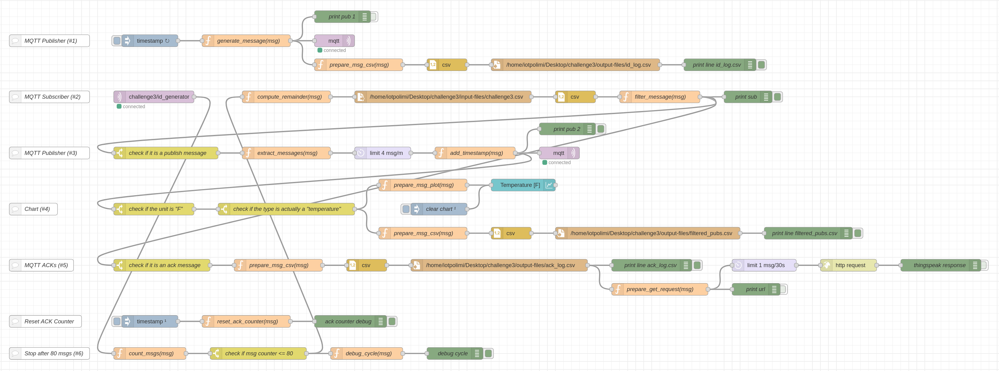

<h1>Node-RED Simple Project</h1>

[![License: MIT][license-image]][license]

This project is an optional activity of "Internet of Things", course of "**Computer Science and Engineering**" (MSc) held at Politecnico di Milano (2023/2024).

**Professor**: Matteo Cesana

<h2>Project specification</h2>

The project consists of a simple flow of interconnected nodes working together to accomplish different objectives. It was developed using Node-RED, a visual programming tool based on flow-based development principles.

The flow is designed to generate messages, process them, save them in a CSV file, and plot them in a chart. 

Additionally, it exchanges messages using the MQTT protocol and communicates with the Thingspeak server via GET requests, accessible at the provided link: [https://thingspeak.com/channels/2504435](https://thingspeak.com/channels/2504435).

You can find additional information about the project in the [report](report/report.pdf).

<h2>Copyright and license</h2>

This project is copyright 2025.

Licensed under the **[MIT License][license]**; you may not use this software except in compliance with the License.

[license]: https://github.com/christian-confalonieri/Node-RED-Simple-Project/blob/main/LICENSE
[license-image]: https://img.shields.io/badge/License-MIT-blue.svg